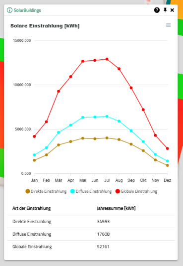
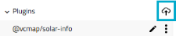
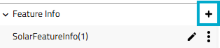
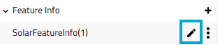
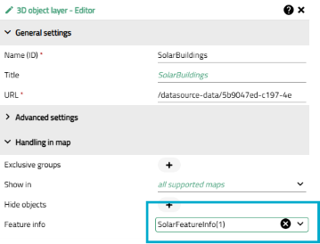
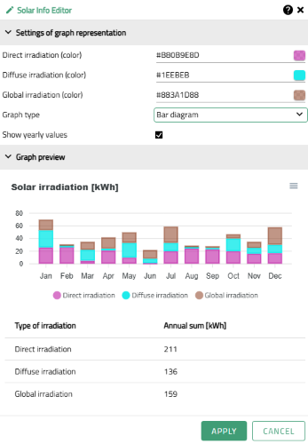

# Solar Feature Info View for VC Solar Backend

## Solar Feature info View

With the help of the plugin, the values calculated by VC Solar Backend can be
displayed as diagram. The diagram shows the monthly irradiation values as graphs
for direct, diffuse and global solar irradiation in kwh per month. Optionally,
a table is displayed which shows the annual total of the individual types of
irradiation. The diagram can be downloaded as an image in svg and png format.
In addition, the raw data can be exported as a CSV file.

## App Configurator

### Activate Plugin

1. Add plugin **@vcmap/vcs-solar-balloon** in the plugins section
   
2. Add **SolarFeatureInfo** to the feature info section
   
3. Configure the solar feature info according to [Settings in Feature Info Section](#settings-in-feature-info-section)
   
4. Assign the the solar feature info to your solar layer
   

### Settings in Feature Info Section

In the app configurator, you can configure the plugin according to your own wishes.
The following options are available here:

- Selection of the graph type (line chart or bar chart)
- Setting the colors for irradiation values as HEX color string
- Toogle option for optional table

All changes made are displayed in the preview and give an impression of
give an impression of how the graphs will look in the VC map.

